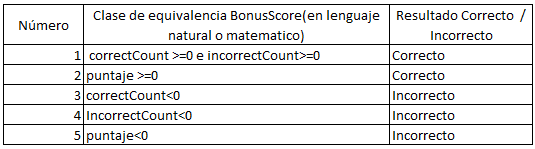
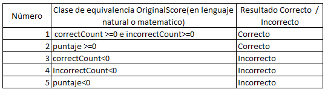
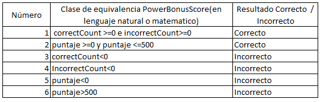
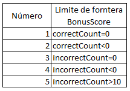
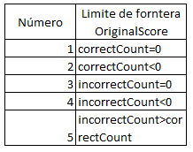
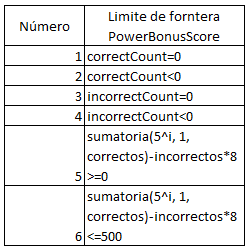

### LABORATORIO 4 - HANGMAN - 2021-1
## Parte I
> ## Teniendo en cuenta dichas especificaciones, en la clase donde se implementarán
 las pruebas (GameScoreTest), en los comentarios iniciales, especifique las clases de 
equivalencia para las tres variantes de GameScore, e identifique condiciones de frontera.
>>
>> **Clases de eqivalencia**
>>>
>>> 
>>>
>>> 
>>>
>>> 
>>>
>>
>> **Limite de frontera**
>>>
>>> 
>>>
>>> 
>>>
>>> 
>>>
